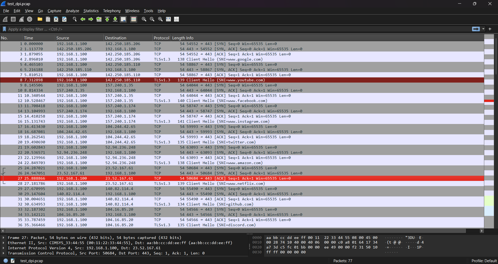
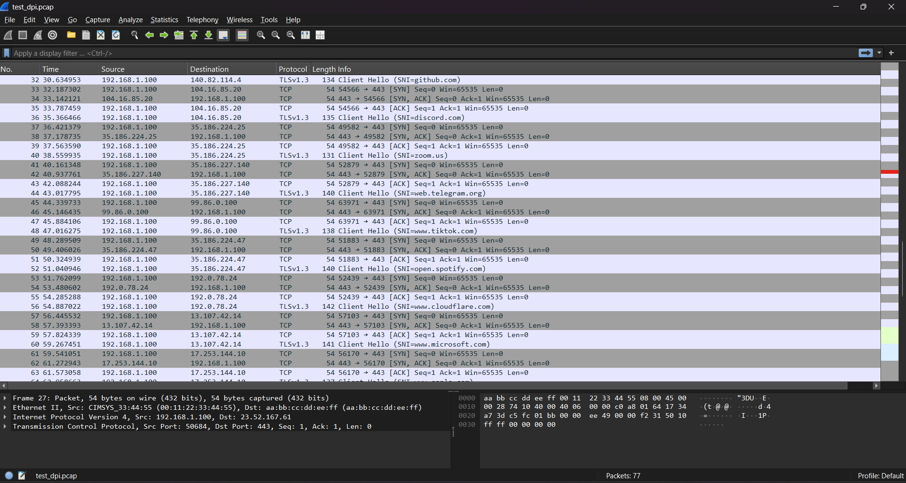
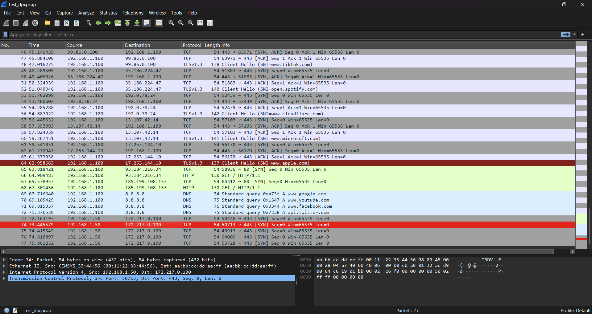
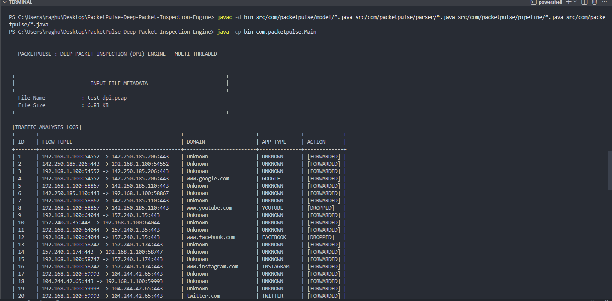
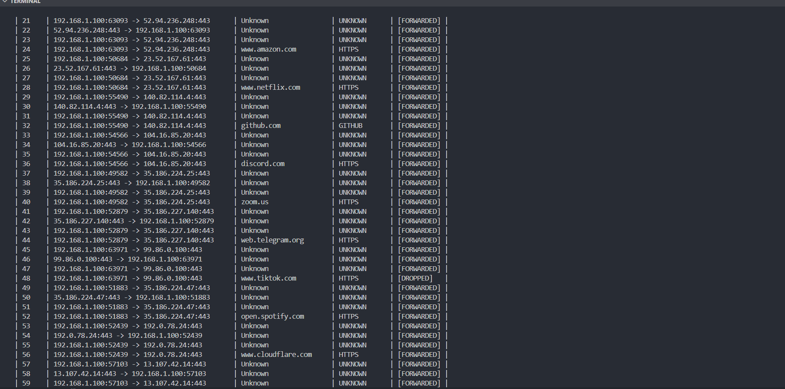
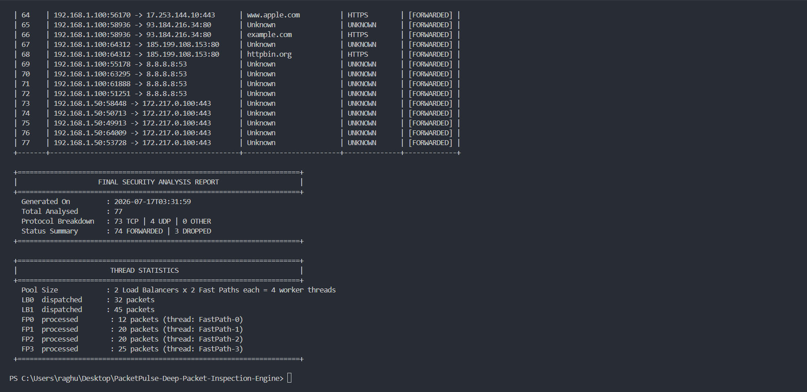

# PacketPulse - Deep Packet Inspection Engine

A multi-threaded Deep Packet Inspection (DPI) engine written in Java. It reads
packets from a `.pcap` file, figures out which website or app each connection
belongs to (even though the traffic is HTTPS-encrypted), and decides whether
to forward or drop each packet based on a set of rules - the same basic idea
behind a real firewall.

## Tech Stack

- **Language:** Java (plain JDK, no external libraries or frameworks)
- **Concurrency:** `Thread` / `Runnable`, `ReentrantReadWriteLock`, `LongAdder`,
  `ConcurrentLinkedQueue`, a custom thread-safe blocking queue (`TSQueue`)
- **Collections:** `HashMap`, `HashSet`, `List`
- **File I/O:** `DataInputStream` / `FileInputStream` for raw byte-level
  `.pcap` reading
- **Networking:** manual Ethernet / IPv4 / TCP / UDP header parsing, TLS
  Client Hello parsing, bit-level operations (shifting, masking) to read
  multi-byte fields from raw bytes
- **Build:** plain `javac` - no Maven or Gradle

## Features

- Reads raw packets out of a `.pcap` capture file
- Parses Ethernet, IPv4, TCP, and UDP headers directly from the byte stream
- Extracts the domain name from encrypted HTTPS traffic by parsing the TLS
  Client Hello and reading the SNI extension
- Extracts the domain name from plain HTTP traffic via the `Host:` header
- Maps a domain to a known app (YouTube, Facebook, Google, etc.)
- Rule-based filtering on four axes: source IP, destination port, app type,
  and domain (with subdomain matching)
- Multi-threaded pipeline (2 load balancers, 4 worker threads) using
  consistent hashing so every packet of the same connection always lands on
  the same worker
- Per-flow stateful tracking - a flow is classified and rule-checked once,
  and every later packet of that flow reuses the stored decision
- Thread-safe, lock-free stats aggregation across all worker threads
- Console report: per-packet traffic log, forwarded/dropped summary, and
  per-thread work distribution

## What This Project Does

When a browser connects to a site like `youtube.com` over HTTPS, the
connection itself is encrypted, but the very first message of the handshake
(the TLS Client Hello) sends the site's domain name in plain text, so the
server knows which certificate to present. This is called SNI (Server Name
Indication). This project pulls that domain name straight out of the raw
packet bytes and uses it to identify the traffic.

Once a domain is identified, it's checked against a list of rules (blocked
domains, blocked apps, blocked IPs, blocked ports) and the packet is marked
FORWARDED or DROPPED.

```
.pcap file -> read packets -> parse headers -> hash to a worker thread
                                                        |
                                        find domain, check rules,
                                        remember the decision for that flow
                                                        |
                                                        v
                                    FORWARD / DROP + final report
```

## Project Structure

```
src/com/packetpulse/
  model/
    AppType.java          - known apps (YouTube, Facebook, ...) + a function
                            that maps a domain name to one of them
    Connection.java       - everything known about one flow: its domain,
                            app type, whether it's blocked, packet/byte counts
    ConnectionState.java  - NEW / ESTABLISHED / CLASSIFIED / BLOCKED / CLOSED
    DPIStats.java         - global counters, safe to update from many threads
    FiveTuple.java        - identifies a flow: src IP+port, dst IP+port, protocol
    PacketAction.java     - FORWARD / DROP / INSPECT / LOG_ONLY
    PacketJob.java        - one packet plus everything the parser found in it

  parser/
    PacketParser.java     - reads raw bytes, pulls out IP addresses, ports,
                            protocol, TCP flags, payload offset
    PcapReader.java       - opens the .pcap file and reads out every packet's
                            raw bytes
    SNIExtractor.java     - digs into the payload and extracts the domain
                            name (from a TLS Client Hello or an HTTP Host
                            header)

  pipeline/
    FastPathProcessor.java - worker thread: finds the domain, checks the
                              rules, remembers the decision for that flow
    LoadBalancer.java       - worker thread: decides which
                              FastPathProcessor should handle a packet
    RuleManager.java        - stores block lists (IP/port/app/domain) and
                              answers "should this be blocked?"
    TSQueue.java             - queue that multiple threads can push/pop from
                              safely at the same time

  Main.java              - starts everything, feeds packets in, prints the
                            final report
```

## Architecture

```
                Main (reads the .pcap file)
                         |
           hashes each packet by its flow ID
                         |
            +------------+------------+
            v                         v
      LoadBalancer 0            LoadBalancer 1
       (1 thread)                (1 thread)
            |                         |
      +-----+-----+             +-----+-----+
      v           v              v           v
  FastPath 0  FastPath 1    FastPath 2   FastPath 3
  (1 thread)  (1 thread)    (1 thread)   (1 thread)
```

Two LoadBalancer threads, each owning two FastPathProcessor threads - four
worker threads in total. Every packet is hashed on its flow ID (source and
destination IP/port + protocol), so all packets of the same connection
always land on the same LoadBalancer and the same FastPathProcessor. That's
what makes it possible to track a flow's state without needing to lock
anything shared between workers - each FastPathProcessor only ever touches
its own private table of flows, from its own thread.

## Stateful Flow Tracking

Every flow gets a `Connection` object the first time a packet for it is
seen. The first time a domain is found for that flow (from its TLS Client
Hello or HTTP request), the rules are checked once, and the result
(FORWARD or DROP) is stored on that `Connection`, along with its state
(`CLASSIFIED` or `BLOCKED`). Every later packet on that same flow reuses the
stored decision instead of re-extracting the domain and re-checking the
rules - closer to how a real firewall works, since it blocks or allows a
whole connection rather than judging every packet in isolation.

TCP handshake flags (SYN, SYN-ACK, FIN) are also tracked per flow, so the
engine knows when a connection opens and closes.

## Building and Running

Compile:
```
javac -d bin src/com/packetpulse/model/*.java src/com/packetpulse/parser/*.java src/com/packetpulse/pipeline/*.java src/com/packetpulse/*.java
```

Run:
```
java -cp bin com.packetpulse.Main
```

The program looks for a file named `test_dpi.pcap` in the project root.

## Sample Run

**Input file:** `test_dpi.pcap` — 6.83 KB, 77 packets, a mix of:
- HTTPS/TLS connections to real-world sites — Google, YouTube, Facebook,
  Instagram, Twitter, Amazon, Netflix, GitHub, Discord, Zoom, Telegram,
  TikTok, Spotify, Cloudflare, Microsoft, Apple
- A couple of plain HTTP requests
- A few DNS lookups

### Input Screenshots

| | |
|---|---|
|  |  |
| **Fig 1.** Capture file loaded into the project | **Fig 2.** Packet-level view of the input traffic |


**Fig 3.** Sample of the traffic contained in `test_dpi.pcap`

### Console Output

```
==========================================================================
   PACKETPULSE : DEEP PACKET INSPECTION (DPI) ENGINE - MULTI-THREADED
==========================================================================

 +----------------------------------------------------------------------+
 |                         INPUT FILE METADATA                          |
 +----------------------------------------------------------------------+
   File Name            : test_dpi.pcap
   File Size            : 6.83 KB
 +----------------------------------------------------------------------+

 [TRAFFIC ANALYSIS LOGS]
 +-------+-----------------------------------------------+------------------------+--------------+-------------+
 | ID    | FLOW TUPLE                                    | DOMAIN                 | APP TYPE     | ACTION      |
 +-------+-----------------------------------------------+------------------------+--------------+-------------+
 | 1     | 192.168.1.100:54552 -> 142.250.185.206:443    | Unknown                | UNKNOWN      | [FORWARDED] |
 | 4     | 192.168.1.100:54552 -> 142.250.185.206:443    | www.google.com         | GOOGLE       | [FORWARDED] |
 | 8     | 192.168.1.100:58867 -> 142.250.185.110:443    | www.youtube.com        | YOUTUBE      | [DROPPED]   |
 | 12    | 192.168.1.100:64044 -> 157.240.1.35:443       | www.facebook.com       | FACEBOOK     | [DROPPED]   |
 | 48    | 192.168.1.100:63971 -> 99.86.0.100:443        | www.tiktok.com         | HTTPS        | [DROPPED]   |
 | ...   | (72 more rows - 77 total)                     |                        |              |             |
 +-------+-----------------------------------------------+------------------------+--------------+-------------+

 +======================================================================+
 |                    FINAL SECURITY ANALYSIS REPORT                    |
 +======================================================================+
   Generated On         : 2026-07-17T03:31:59
   Total Analysed       : 77
   Protocol Breakdown   : 73 TCP | 4 UDP | 0 OTHER
   Status Summary       : 74 FORWARDED | 3 DROPPED
 +======================================================================+

 +======================================================================+
 |                       THREAD STATISTICS                              |
 +======================================================================+
   Pool Size            : 2 Load Balancers x 2 Fast Paths each = 4 worker threads
   LB0  dispatched      : 32 packets
   LB1  dispatched      : 45 packets
   FP0  processed        : 12 packets (thread: FastPath-0)
   FP1  processed        : 20 packets (thread: FastPath-1)
   FP2  processed        : 20 packets (thread: FastPath-2)
   FP3  processed        : 25 packets (thread: FastPath-3)
 +======================================================================+
```

### Output Screenshots

| | | |
|---|---|---|
|  |  |  |
| **Fig 4.** Per-packet traffic log | **Fig 5.** Final security summary | **Fig 6.** Per-thread work distribution |

### Reading the Results

- **3 packets dropped:** YouTube (domain rule), Facebook (app rule), TikTok
  (domain rule) — all matched against the rules configured in `Main.java`.
- **`Unknown` / `UNKNOWN` rows:** these are the handshake packets (SYN,
  SYN-ACK) that arrive *before* the TLS Client Hello — no domain has been
  seen for that flow yet.
- **Amazon / Netflix / Discord show up as `HTTPS`, not their own app type:**
  `AppType.java` currently only has explicit name-matching for a handful of
  services (Google, Facebook, YouTube, Twitter, Instagram, GitHub) —
  everything else falls through to the generic `HTTPS` label.
- **Work is unevenly split across the 4 workers (12 / 20 / 20 / 25):**
  expected — hashing distributes whole *flows*, not individual packets, and
  there are only ~20 distinct flows across the 77 packets.

## Known Limitations

- Input filename is hardcoded (`test_dpi.pcap`), not read from a
  command-line argument.
- Block rules are hardcoded in `Main.java` - no config file or CLI flags.
- No output `.pcap` file is written - the engine only prints a report.
- IPv4 only, no IPv6.
- Only single-packet TLS Client Hellos are handled - one split across
  multiple TCP segments won't be reassembled.
- `AppType.sniToAppType()` only recognizes a handful of domains by name.

## Ideas for Extending This

- Read the input filename and block rules from command-line arguments.
- Write the forwarded packets out to a new `.pcap` file.
- Add more domain-to-app mappings in `AppType.java`.
- Add subnet/CIDR-based IP blocking instead of single-IP matching.
- Add unit tests for `PacketParser` and `SNIExtractor`.
- Add IPv6 support.