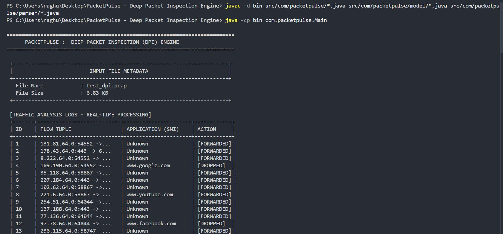
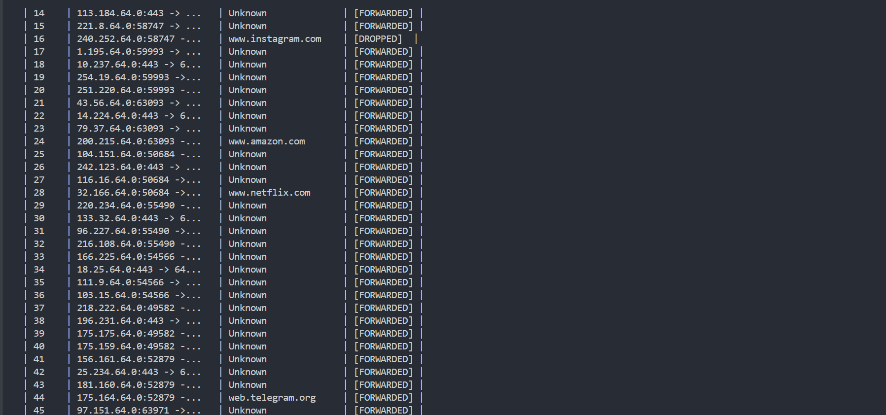
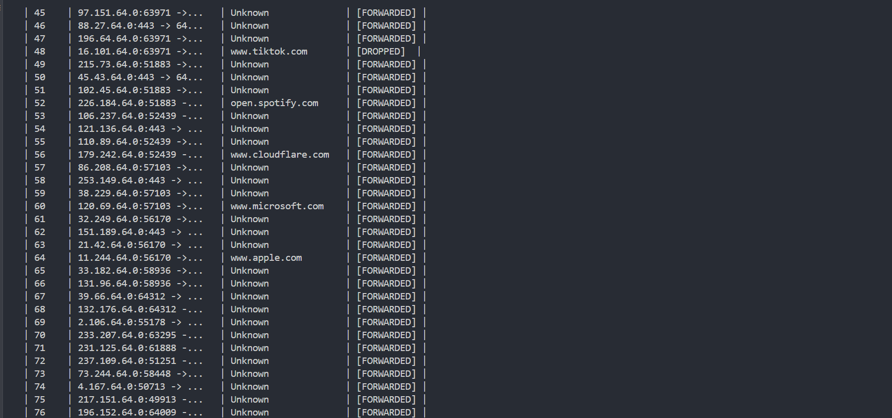
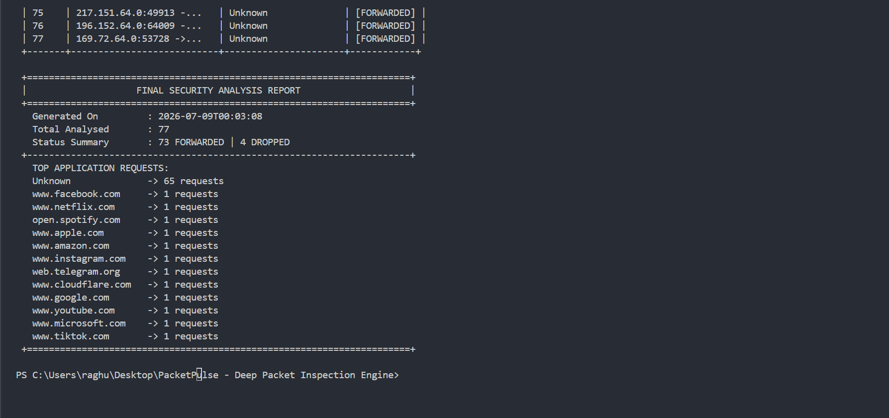

# PacketPulse - Deep Packet Inspection (DPI) Engine

<p align="center">

**Java-Based Offline Deep Packet Inspection (DPI) Engine**

**PCAP Analysis • Packet Parsing • TLS SNI Extraction • Rule-Based Packet Filtering**

# Author

**Raghuveer Kumawat**

Software Engineer | Computer Science & Engineering | Full Stack Developer
</p>


---

# Overview

PacketPulse is a Java-based Deep Packet Inspection (DPI) project that analyzes offline network traffic stored in PCAP files. The application reads captured packets, parses Ethernet, IPv4, TCP, and UDP protocols, extracts domain information from packet payloads, applies rule-based filtering using a policy engine, and generates a detailed console-based traffic analysis report.

The project is designed to demonstrate the fundamental workflow of packet inspection and network traffic analysis using Java. It provides a modular implementation of protocol parsing, payload inspection, and policy-based packet filtering.

---

# Project Highlights

| Category | Details |
|----------|---------|
| Project Name | PacketPulse – Deep Packet Inspection Engine |
| Language | Java |
| Project Type | Network Security / Computer Engineering / Packet Analysis |
| Input | Offline PCAP File (`test_dpi.pcap`) |
| Output | Console-Based Traffic Analysis Report |
| Architecture | Modular Package Structure |
| Processing | Offline Packet Inspection |
| Status | Completed |

---

# Why This Project?

Modern networks generate thousands of packets every second. Simply checking IP addresses and port numbers is often insufficient to understand which website or service is being accessed.

PacketPulse demonstrates how captured packets can be parsed, inspected, and analyzed to identify destination domains and apply security rules. The project focuses on learning packet processing, protocol analysis, and basic firewall policy implementation using Java.

---

# Features

- Read packets from offline PCAP files
- Parse Ethernet Frames
- Parse IPv4 Headers
- Parse TCP Packets
- Parse UDP Packets
- Generate FiveTuple flow information
- Extract packet payload
- Detect TLS Client Hello packets
- Extract TLS Server Name Indication (SNI)
- Identify destination domains
- Apply rule-based domain filtering
- Generate traffic statistics
- Display structured console reports
- Modular Java architecture
- Easy to extend for additional protocols

---

# Technologies Used

## Programming Language

- Java

## Core Java

- Object-Oriented Programming (OOP)
- Exception Handling
- File Handling
- Java Collections Framework
- Java Concurrency

## Collections Used

- HashMap
- HashSet
- ArrayList
- LinkedBlockingQueue
- LongAdder

## Networking Concepts

- Ethernet
- IPv4
- TCP
- UDP
- TLS Client Hello
- Server Name Indication (SNI)
- PCAP File Parsing

## Development Tools

- Visual Studio Code
- Git
- GitHub

---

# Project Structure

```text
PacketPulse-Deep-Packet-Inspection-Engine

│

├── docs
│   ├── input
│   └── output
│
├── src
│   └── com
│       └── packetpulse
│           ├── model
│           ├── parser
│           ├── pipeline
│           ├── Main.java
│           └── PolicyEngine.java
│
├── test_dpi.pcap
├── README.md
├── PROJECT_DETAILS.md
├── LICENSE
└── .gitignore
```

---

# Project Workflow

```text
test_dpi.pcap
       │
       ▼
PcapReader
       │
       ▼
PacketParser
       │
       ▼
FiveTuple Generation
       │
       ▼
Payload Inspection
       │
       ▼
SNI / Domain Detection
       │
       ▼
Policy Engine
       │
       ▼
FORWARDED / DROPPED
       │
       ▼
Traffic Statistics
       │
       ▼
Console Report
```

---

# Input

PacketPulse accepts an offline packet capture file (`test_dpi.pcap`) as input.

The PCAP file contains captured network packets. Every packet is read sequentially, parsed, inspected, and processed through the packet inspection pipeline.

### Input Screenshots

<p align="center">

</p>

<p align="center">

</p>

<p align="center">

</p>

---

# Output

After processing all packets, PacketPulse generates a structured console-based security analysis report.

The report includes:

- Input File Metadata
- Packet-by-Packet Analysis
- Flow Tuple Information
- Detected Domain
- Packet Action (FORWARDED / DROPPED)
- Final Security Analysis Report
- Traffic Statistics

### Output Screenshots

<p align="center">

</p>

<p align="center">

</p>

<p align="center">

</p>

<p align="center">

</p>

---

# Current Implementation

The current implementation supports:

- Offline PCAP Processing
- Ethernet Parsing
- IPv4 Parsing
- TCP Parsing
- UDP Parsing
- Packet Payload Extraction
- FiveTuple Flow Generation
- TLS SNI Extraction
- Domain Detection
- Rule-Based Domain Filtering
- Traffic Statistics
- Console Report Generation

---

# Real-World Applications

Although developed as an educational project, PacketPulse demonstrates concepts used in:

- Network Traffic Analysis
- Packet Inspection
- Firewall Rule Processing
- Network Monitoring
- Security Event Analysis
- Computer Network Laboratories
- Cyber Security Learning
- Network Forensics

---

# System Requirements

- Java JDK 17 or later
- Visual Studio Code (or any Java IDE)
- Windows / Linux / macOS

---

# Project Setup

1. Clone the repository.

```bash
git clone https://github.com/Raghuveer-Tech/PacketPulse---Deep-Packet-Inspection-Engine.git
```

2. Open the project in your preferred Java IDE.

3. Ensure `test_dpi.pcap` is present in the project root.

4. Open the integrated terminal.

---

# Compile

```bash
javac -d bin src/com/packetpulse/model/*.java src/com/packetpulse/parser/*.java src/com/packetpulse/pipeline/*.java src/com/packetpulse/*.java
```

---

# Run

```bash
java -cp bin com.packetpulse.Main
```

---

# Expected Output

After successful execution, the console displays:

- Input File Metadata
- Packet Analysis Logs
- Flow Tuple
- Detected Domain
- Packet Action
- Final Security Analysis Report
- Traffic Statistics

---

# Skills Demonstrated

- Java Programming
- Object-Oriented Programming
- Computer Networks
- TCP/IP Protocol Analysis
- Packet Parsing
- Deep Packet Inspection (DPI)
- TLS SNI Extraction
- Rule-Based Packet Filtering
- Java Collections
- Java Concurrency
- Modular Software Design
- Git & GitHub

---

# Documentation

Detailed project documentation is available in:

**PROJECT_DETAILS.md**

The document includes:

- Project Explanation
- Architecture
- Workflow
- Input & Output Explanation
- Real-Life Use Cases
- Execution Flow
- Future Scope

---

# Future Improvements

- Live Packet Capture
- IPv6 Support
- DNS Query Parsing
- HTTP Header Inspection
- Configurable Rule Files
- GUI Dashboard
- JSON Report Export

---

# Author

**Raghuveer Kumawat**

Software Engineer | Computer Science & Engineering | Full Stack Developer

---

# License

This project is licensed under the MIT License.

See the **LICENSE** file for complete license information.